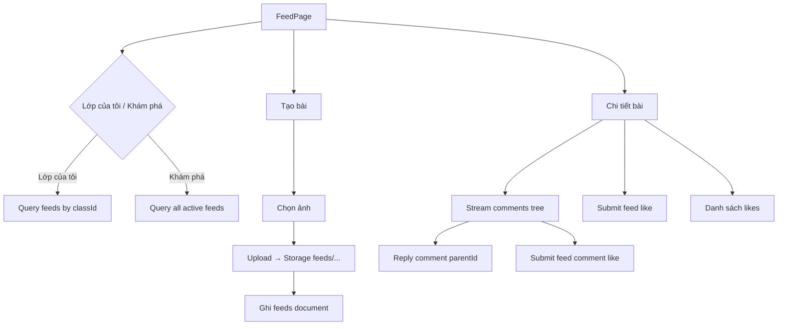

# Bảng tin (Feed) — Thiết kế Domain & Data

> Tham chiếu trước khi implement `lib/features/feed/domain` và `lib/features/feed/data`.  
> Đặt tên **đơn giản**, đồng bộ Firestore & code hiện có (`users`, `classes`, `students`, `leave_requests`, `attendances`).

---

## 0. Quy ước đặt tên (đồng bộ toàn app)

### Firestore

| Quy tắc | Ví dụ hiện có | Bảng tin áp dụng |
|---------|---------------|------------------|
| Collection **snake_case**, số nhiều, tên ngắn | `leave_requests`, `attendance_sessions` | `feeds` |
| Subcollection tên đơn | — | `likes`, `comments` |
| Field **camelCase** | `classId`, `centerId`, `fullName` | giữ nguyên |
| ID document tham chiếu | `class-1`, `center-1`, UID Firebase | `feeds` dùng auto-id; `likes/{userId}` |
| Thời điểm (`*At`) | `createdAt`, `submittedAt` → `Timestamp` | `createdAt`, `updatedAt` |
| Ảnh user (collection `users`) | `avatar` | `avatar` (không dùng `avatarUrl` trên user) |
| Ảnh học sinh | `avatarUrl` | — |
| Người gửi denormalize | `senderName`, `senderAvatarUrl` (`leave_requests`) | `fullName`, `avatar` (lấy từ `users`) |
| Trạng thái | `status: "active"` (`users`, `classes`) | `status: "active"` \| `"deleted"` |

### Dart (feature `feed/`)

| Layer | Quy tắc | Ví dụ |
|-------|---------|-------|
| Entity | Tên domain entity | `Feed`, `FeedResponse`, `Comment`, `FeedLike`, `LikeResult`, `Author` |
| Use case | `get_*` / `submit_*` / `stream_*` | `GetClassFeedsUseCase`, `SubmitFeedUseCase`, `StreamFeedCommentsUseCase` |
| Model | `*Data` | `FeedData`, `CommentData`, `FeedLikeData` |
| Mapper | `*DataMapper` | `FeedDataMapper` |
| Source | Mô tả nguồn | `FeedFirestoreSource`, `FeedStorageSource` |
| Repository | `FeedRepository` | giống `AttendanceRepository` |

---

## 1. Liên kết schema hiện có

```
users/{uid}
  ├─ fullName, avatar, role, classId, centerId, status
  └─ (GV tạo bài) authorId trỏ về đây

classes/{classId}          e.g. class-1
  ├─ name, code, centerId, status
  └─ denormalize className lên feed

feeds/{feedId}             ← collection MỚI
  ├─ classId  → classes
  ├─ centerId → users / classes
  ├─ authorId → users
  ├─ likes/{userId}        → users
  └─ comments/{commentId}  → users (authorId)
```

| Tab UI | Query | Ghi chú |
|--------|-------|---------|
| **Lớp của tôi** | `feeds` where `authorId == user.id` | Bài của GV hiện tại |
| **Khám phá** | `feeds` where `isPublic == true` | Bài công khai của mọi GV |

> GV chỉ tạo bài cho `classId` trùng `users.classId`. Phụ huynh phase sau: xem / like / comment, không tạo bài.

### Luồng chính



---

## 2. Firebase

### 2.1 Storage

- **Bucket:** `gs://tanlu-ceab0.firebasestorage.app`
- **Path ảnh** (theo `classId` giống format `class-1`):

```
feeds/{teacherId}/{feedId}/{index}.jpg
```

| Thành phần | Ví dụ |
|------------|-------|
| `teacherId` | UID giáo viên (`authorId`) |
| `feedId` | auto-id Firestore |
| `index` | `0`, `1`, `2`… |

- Cần thêm `firebase_storage` + `FirebaseStorage.instance` trong `RegisterModule`
- Upload xong → `downloadURL` → lưu vào field `images` (mảng string)

### 2.2 Firestore — `feeds/{feedId}`

Document bài viết. Denormalize từ `users` + `classes` lúc tạo — không join khi scroll feed.

```json
{
  "authorId": "wqdr0ztE6jV5yPtL4a2sNKwCvir1",
  "fullName": "Giáo viên tốt",
  "avatar": "",
  "role": "teacher",
  "classId": "class-1",
  "className": "Lớp Chồi 1",
  "centerId": "center-1",
  "content": "Hôm nay các bé cùng vẽ tranh...",
  "images": [
    "https://firebasestorage.googleapis.com/.../0.jpg"
  ],
  "likeCount": 0,
  "commentCount": 0,
  "allowComments": true,
  "isPublic": false,
  "status": "active",
  "createdAt": "Timestamp",
  "updatedAt": "Timestamp"
}
```

| Field | Kiểu | Nguồn / ghi chú |
|-------|------|-----------------|
| `authorId` | string | `users` document id |
| `fullName` | string | copy `users.fullName` |
| `avatar` | string | copy `users.avatar` |
| `role` | string | copy `users.role` — `teacher`, `parent`… |
| `classId` | string | `class-1` — khớp `users.classId`, `students.classId` |
| `className` | string | copy `classes.name` |
| `centerId` | string | copy `users.centerId` / `classes.centerId` |
| `content` | string | Nội dung text |
| `images` | string[] | URL Storage — tên ngắn, rõ nghĩa |
| `likeCount` | int | Transaction khi like/unlike |
| `commentCount` | int | Transaction khi thêm comment |
| `allowComments` | bool | Toggle UI tạo bài |
| `isPublic` | bool | `true` → hiện tab Khám phá; `false` → chỉ tab Lớp của tôi |
| `status` | string | `"active"` — đồng bộ `users`/`classes`; xóa mềm → `"deleted"` |
| `createdAt` | Timestamp | `FirestoreJson` — giống `attendances.createdAt` |
| `updatedAt` | Timestamp | Cập nhật khi sửa bài (phase sau) |

> Không lưu field `id` trong document — lấy từ document id (`includeToJson: false` trong model).

### 2.3 Subcollection `feeds/{feedId}/likes/{userId}`

Document id = `userId` người like (giống pattern id = entity id).

```json
{
  "fullName": "Nguyễn Văn Tuấn",
  "avatar": "",
  "role": "parent",
  "createdAt": "Timestamp"
}
```

| Field | Ghi chú |
|-------|---------|
| `fullName`, `avatar`, `role` | Copy từ `users` lúc like — đồng bộ field `users` |
| `createdAt` | Thời điểm like |

- **Đã like chưa:** check tồn tại `likes/{currentUserId}`
- **Toggle:** transaction tạo/xóa doc + `likeCount ± 1`

### 2.4 Subcollection `feeds/{feedId}/comments/{commentId}`

Hỗ trợ reply dạng cây (giống Facebook): `parentId` trỏ tới bất kỳ comment nào.

```json
{
  "authorId": "uid_parent",
  "fullName": "Nguyễn Văn Tuấn",
  "avatar": "",
  "role": "parent",
  "content": "Bé nhà chị vẽ rất đẹp!",
  "parentId": null,
  "likeCount": 0,
  "createdAt": "Timestamp"
}
```

| Field | Ghi chú |
|-------|---------|
| `authorId` | `users` id |
| `fullName`, `avatar`, `role` | Denormalize từ `users` |
| `content` | Nội dung |
| `parentId` | `null` = comment gốc; có giá trị = reply comment cha (lồng nhiều cấp) |
| `likeCount` | Transaction khi like/unlike comment |
| `createdAt` | Sắp xếp ASC |

> Gom cây reply ở `FeedRepositoryImpl`: flat list → `Comment.replies` đệ quy.

### 2.4.1 Subcollection `feeds/{feedId}/comments/{commentId}/likes/{userId}`

Like trên từng bình luận — cùng schema với like bài.

```json
{
  "fullName": "Nguyễn Văn Tuấn",
  "avatar": "",
  "role": "parent",
  "createdAt": "Timestamp"
}
```

- **Toggle:** transaction tạo/xóa doc + `comment.likeCount ± 1`
- Document id = `userId` người like

### 2.5 Indexes

```
Collection: feeds
  - authorId ASC, status ASC, createdAt DESC   → tab Lớp của tôi
  - isPublic ASC, status ASC, createdAt DESC    → tab Khám phá
```

### 2.6 Security Rules (gợi ý)

```
feeds:        đọc = authenticated; tạo/sửa/xóa = authorId == auth.uid && role == teacher
likes:        đọc = authenticated; ghi = auth.uid == userId
comments:     đọc = authenticated; tạo = authenticated && allowComments; xóa = author hoặc chủ bài
```

---

## 3. Cấu trúc thư mục code

```
lib/features/feed/
├── docs/
│   └── FEED_DATA_DESIGN.md
├── domain/          # Feed, Comment, FeedRepository, use cases
├── data/            # *Data, mappers, Firestore/Storage sources
└── presentation/
    ├── feed_page/                    # FeedPage — màn bảng tin chính
    │   ├── pages/
    │   │   └── feed_page.dart
    │   ├── bloc/
    │   │   ├── feed_bloc.dart
    │   │   ├── feed_event.dart
    │   │   └── feed_state.dart
    │   └── widgets/
    │       ├── feed_app_bar.dart
    │       ├── feed_tab_bar.dart
    │       ├── my_feed_tab/
    │       │   ├── my_feed_tab.dart       # tab wrapper
    │       │   ├── my_feed_body.dart      # body (luôn có body)
    │       │   ├── my_feed_body.dart
    │       │   ├── my_feed_list.dart
    │       │   └── my_feed_item.dart  # item → FeedItem
    │       └── explore_tab/
    │           ├── explore_tab.dart
    │           ├── explore_body.dart
    │           ├── explore_list.dart
    │           └── explore_item.dart
    ├── feed_detail/                  # FeedDetailPage — chi tiết + bình luận
    │   ├── pages/
    │   │   └── feed_detail_page.dart
    │   ├── bloc/
    │   │   ├── feed_detail_bloc.dart
    │   │   ├── feed_detail_event.dart
    │   │   └── feed_detail_state.dart
    │   └── widgets/
    │       ├── feed_detail_body.dart
    │       └── feed_comments_section.dart
    ├── create_feed/                  # CreateFeedPage
    │   ├── pages/
    │   │   ├── create_feed_page.dart
    │   │   └── media_picker_page.dart
    │   ├── bloc/
    │   │   ├── create_feed_bloc.dart
    │   │   ├── create_feed_event.dart
    │   │   └── create_feed_state.dart
    │   └── widgets/
    │       ├── create_feed_body.dart
    │       ├── create_feed_submit_bar.dart
    │       └── compose_card.dart
    ├── widgets/                      # UI dùng chung
    │   ├── feed_item.dart
    │   ├── feed_media_grid.dart
    │   ├── feed_video_player.dart
    │   ├── image_viewer_page.dart
    │   └── media_viewer_bar.dart
    ├── services/
    │   └── video_cache_service.dart
    └── enums/
        ├── feed_tab.dart
        ├── feed_like_filter.dart
        └── feed_notification_filter.dart
```

### Luồng UI chính

```
FeedPage
├── MyFeedTab → MyFeedBody → MyFeedList → MyFeedItem → FeedItem
└── ExploreTab → ExploreBody → ExploreList → ExploreItem → FeedItem

CreateFeedPage → CreateFeedBody (+ MediaPickerPage)
FeedDetailPage → FeedDetailBody → FeedItem + FeedCommentsSection
```

### Quy tắc đặt tên presentation

| Loại | Quy tắc | Ví dụ |
|------|---------|-------|
| Page | `*Page` | `FeedPage`, `FeedDetailPage`, `CreateFeedPage` |
| Tab | `*Tab` + `*Body` + `*List` + `*Item` | `MyFeedTab`, `ExploreBody` |
| Widget bài viết dùng chung | `Feed*` | `FeedItem`, `FeedMediaGrid` |
| Bloc | theo thư mục màn | `feed_page/bloc`, `feed_detail/bloc`, `create_feed/bloc` |
| **Không** dùng | `Post*` trong tên widget, gom bloc chung `presentation/bloc/` | ❌ `FeedPostCard` |

---

## 4. Domain Layer

### 4.1 Entities (`freezed`)

#### `Author`

Snapshot người dùng — field khớp `users` + thêm hiển thị lớp.

```dart
@freezed
class Author with _$Author {
  const factory Author({
    @Default('') String id,
    @Default('') String fullName,
    @Default('') String role,
    @Default('') String avatar,
    String? className,
  }) = _Author;
}
```

#### `Feed`

```dart
@freezed
class Feed with _$Feed {
  const factory Feed({
    @Default('') String id,
    required Author author,
    @Default('') String classId,
    @Default('') String className,
    @Default('') String centerId,
    @Default('') String content,
    @Default([]) List<String> images,
    @Default(0) int likeCount,
    @Default(0) int commentCount,
    @Default(true) bool allowComments,
    @Default('active') String status,
    @Default(false) bool isLiked,
    DateTime? createdAt,
    DateTime? updatedAt,
  }) = _Feed;
}
```

`author` build từ `authorId` + `fullName` + `avatar` + `role` trên document.

#### `Comment`

```dart
@freezed
class Comment with _$Comment {
  const factory Comment({
    @Default('') String id,
    @Default('') String feedId,
    required Author author,
    @Default('') String content,
    String? parentId,
    @Default(false) bool isFeedAuthor,
    @Default([]) List<Comment> replies,
    DateTime? createdAt,
  }) = _Comment;
}
```

#### `FeedLike` + `LikeResult` (cùng file `feed_like.dart`)

```dart
/// Người đã like bài — màn danh sách likes.
@freezed
class FeedLike with _$FeedLike {
  const factory FeedLike({
    @Default(Author()) Author author, // author.id = likes/{userId}
    DateTime? likedAt,                // Firestore: createdAt
  }) = _FeedLike;
}

/// Kết quả sau submit like/unlike — dùng chung bài và bình luận.
@freezed
class LikeResult with _$LikeResult {
  const factory LikeResult({
    @Default(false) bool isLiked,
    @Default(0) int likeCount,
  }) = _LikeResult;
}
```

#### `FeedResponse` (phân trang — cùng file `feed.dart`)

```dart
@freezed
class FeedResponse with _$FeedResponse {
  const factory FeedResponse({
    @Default([]) List<Feed> feeds,
    String? nextCursor,
    @Default(false) bool hasMore,
  }) = _FeedResponse;
}
```

### 4.2 `FeedRepository`

```dart
abstract class FeedRepository {
  Future<FeedResponse> getClassFeeds({
    required String classId,
    required String userId,
    String? cursor,
    int limit = 20,
  });

  Future<FeedResponse> getExploreFeeds({
    required String userId,
    String? cursor,
    int limit = 20,
  });

  Future<Feed> getFeed({
    required String feedId,
    required String userId,
  });

  Future<Feed> submitFeed({
    required Feed draft,
    required List<String> localImagePaths,
  });

  Future<({bool isLiked, int likeCount})> toggleLike({
    required String feedId,
    required Author currentUser,
  });

  Future<List<FeedLike>> getFeedLikes(String feedId);

  Stream<List<Comment>> streamComments(String feedId);

  Future<Comment> addComment({
    required String feedId,
    required Author author,
    required String content,
    String? parentId,
  });
}
```

### 4.3 Use Cases

| Use case | Mô tả |
|----------|-------|
| `GetClassFeedsUseCase` | Tab **Lớp của tôi** |
| `GetExploreFeedsUseCase` | Tab **Khám phá** |
| `GetFeedUseCase` | Chi tiết bài |
| `SubmitFeedUseCase` | GV tạo bài + upload ảnh |
| `ToggleFeedLikeUseCase` | Bật/tắt like |
| `GetFeedLikesUseCase` | Màn danh sách người like |
| `StreamFeedCommentsUseCase` | Stream comment realtime |
| `SubmitFeedCommentUseCase` | Comment / reply |

**`SubmitFeedUseCase` validate:**

- `user.role == 'teacher'` && `user.status == 'active'`
- `draft.classId == user.classId`
- `content` không rỗng **hoặc** có ảnh
- Tối đa **9** ảnh
- Lấy `className` từ `classes/{classId}` (hoặc truyền từ UI đã load)

---

## 5. Data Layer

### 5.1 Models

Field Firestore ↔ `*Data` — dùng `FirestoreJson` cho `createdAt` / `updatedAt`.

**`FeedData`** — map 1:1 document `feeds`.

**`CommentData`** — map subcollection `comments`.

**`FeedLikeData`** — map subcollection `likes`; `userId` = document id.

Quy ước giống `LeaveRequestData` / `AttendanceData`:

```dart
@JsonKey(name: 'id', includeToJson: false) String? id,
@JsonKey(name: 'createdAt', fromJson: FirestoreJson.toDateTime, toJson: FirestoreJson.dateTimeToFirestore)
```

### 5.2 Mappers

| Mapper | Entity |
|--------|--------|
| `FeedDataMapper` | `Feed` + ghép `Author` |
| `CommentDataMapper` | `Comment` + ghép `Author` |
| `FeedLikeDataMapper` | `FeedLike` + ghép `Author` |

Khi map `User` → `Author` lúc tạo bài/comment/like:

```dart
Author(
  id: user.id,
  fullName: user.fullName,
  role: user.role,
  avatar: user.avatar ?? '',
)
```

### 5.3 Sources

#### `FeedStorageSource`

```dart
@lazySingleton
class FeedStorageSource {
  Future<List<String>> uploadImages({
    required String classId,
    required String feedId,
    required List<String> localPaths,
  });
}
```

#### `FeedFirestoreSource`

```dart
@lazySingleton
class FeedFirestoreSource {
  // Collection: feeds
  Future<QuerySnapshot> queryClassFeeds({required String classId, ...});
  Future<QuerySnapshot> queryExploreFeeds({...});
  Future<FeedData?> getFeed(String feedId);
  Future<String> submitFeed(FeedData data);
  Future<bool> hasLiked({required String feedId, required String userId});
  Future<void> addLike({required String feedId, required FeedLikeData like});
  Future<void> removeLike({required String feedId, required String userId});
  Stream<List<CommentData>> streamComments(String feedId);
  Future<String> addComment({required String feedId, required CommentData comment});
}
```

Gọi Firestore qua `FirebaseLogger` như `AttendanceFirebaseSource`.

### 5.4 `FeedRepositoryImpl`

```dart
@LazySingleton(as: FeedRepository)
class FeedRepositoryImpl implements FeedRepository { ... }
```

**Tạo bài:**

1. `feedId = firestore.collection('feeds').doc().id`
2. `FeedStorageSource.uploadImages(classId, feedId, paths)` → `images`
3. Đọc `classes/{classId}` lấy `name` → `className` (nếu chưa có)
4. Ghi `FeedData` + `createdAt` / `updatedAt`
5. Map → `Feed`

**Load feed:**

1. Query + phân trang (`limit`, `startAfter`)
2. Map → `List<Feed>`
3. Batch `hasLiked` cho `userId`
4. Trả `FeedResponse`

---

## 6. Mapping UI mock → Domain

| UI hiện tại | Domain | Ghi chú |
|-------------|--------|---------|
| `FeedAuthor.name` | `Author.fullName` | Khớp `users.fullName` |
| `FeedAuthor.avatarUrl` | `Author.avatar` | Khớp `users.avatar` |
| `FeedFeed.mediaColors` | `Feed.images` | URL thật từ Storage |
| `FeedFeed.timeAgo` | `Feed.createdAt` | Format ở presentation |
| `FeedComment.isAuthor` | `Comment.isFeedAuthor` | `author.id == Feed.author.id` |
| `parentCommentId` | `parentId` | Tên ngắn hơn |

---

## 7. Presentation (phase sau)

```
FeedBloc
  ├─ RefreshClassFeeds    → GetClassFeedsUseCase
  ├─ RefreshExploreFeeds  → GetExploreFeedsUseCase
  ├─ LoadMoreClassFeeds
  ├─ SubmitFeedLike        → ToggleFeedLikeUseCase
  └─ RefreshFeedEvent

FeedDetailBloc
  ├─ FeedDetailStarted          → GetFeedUseCase
  ├─ comments stream        → StreamFeedCommentsUseCase
  ├─ FeedDetailSubmitComment        → SubmitFeedCommentUseCase
  └─ SubmitFeedLike

submitFeedBloc
  └─ CreateFeedSubmitted        → SubmitFeedUseCase
```

---

## 8. Thứ tự implement

| # | Việc |
|---|------|
| 1 | `firebase_storage` + `RegisterModule` |
| 2 | Domain: `Author`, `Feed`, `FeedResponse`, `Comment`, `FeedLike`, `LikeResult`, `FeedRepository` |
| 3 | `FeedData`, `CommentData`, `FeedLikeData` + mappers |
| 4 | `FeedStorageSource`, `FeedFirestoreSource` |
| 5 | `FeedRepositoryImpl` |
| 6 | 8 use cases |
| 7 | Firestore indexes + rules |
| 8 | Bloc + nối presentation |
| 9 | Xóa `feed_mock_data.dart` |

---

## 9. Edge cases

| Tình huống | Xử lý |
|------------|-------|
| Upload ảnh lỗi giữa chừng | Xóa file đã upload; không tạo document |
| Like đồng thời | Firestore transaction |
| `allowComments == false` | `SubmitFeedCommentUseCase` từ chối |
| Xóa bài | `status = "deleted"` + xóa ảnh Storage (phase sau) |
| Có bài mới khi user đang cuộn feed | Không auto chèn vào list hiện tại; tăng `newFeedCount` và hiện banner `Có bài viết mới` |
| Mở app từ push notification | Điều hướng `FeedPage` hoặc `FeedDetailPage(feedId)`; sau đó vẫn fetch/stream dữ liệu từ Firestore |
| `classId` không tồn tại | Validate trước khi tạo bài |

---

## 10. Realtime & Notification policy (không dùng socket)

### 10.1 Quyết định kiến trúc

- **Không dùng socket** cho bảng tin.
- Dùng **Firestore stream** cho realtime data.
- Dùng **FCM push notification** để báo có bài mới khi app nền/tắt hoặc khi user đang ở màn khác.

### 10.2 Phạm vi stream

| Màn hình | Cách cập nhật |
|----------|---------------|
| Feed list (`Lớp của tôi`, `Khám phá`) | Stream có điều kiện (không làm nhảy scroll) |
| Feed detail | Load Feed + stream comments |
| Like count | Cập nhật qua transaction và refresh item hiện tại |

### 10.3 Quy tắc UX tránh nhảy scroll

1. Nếu user đang ở gần đầu feed (`scrollOffset <= threshold`) thì cho phép merge Feed mới ngay đầu danh sách.
2. Nếu user đang cuộn ở giữa feed thì **không mutate list đang xem**; chỉ tăng `newFeedCount`.
3. Hiển thị banner nổi: `Có {newFeedCount} bài viết mới`.
4. Khi user bấm banner:
   - scroll lên đầu,
   - merge batch Feed mới,
   - reset `newFeedCount = 0`.

> Mục tiêu: realtime nhưng không gây \"nhảy\" khi đang đọc.

### 10.4 Flow push notification

```mermaid
flowchart TD
  A[Teacher tạo Feed] --> B[feeds/{feedId} được tạo]
  B --> C[Cloud Function onCreate feeds]
  C --> D[Gửi FCM theo topic class_{classId} hoặc feed_all]
  D --> E[Thiết bị nhận push]
  E --> F[Mở app/deeplink Feed hoặc FeedDetail]
  F --> G[Client fetch/stream Firestore để đồng bộ thật]
```

> Push chỉ là tín hiệu thông báo, **không** là nguồn dữ liệu chính.

### 10.5 Topic gợi ý

- `class_{classId}`: bài mới trong lớp người dùng.
- `feed_all`: tab Khám phá (nếu muốn broadcast toàn bộ).

---

## 11. Checklist đồng bộ

- [ ] Collection `feeds` — cùng style `attendances`, `leave_requests`
- [ ] Field `classId`, `centerId`, `fullName`, `avatar`, `role`, `status` — khớp `users` / `classes`
- [ ] `createdAt` / `updatedAt` — `FirestoreJson` + `Timestamp`
- [ ] Entity `freezed` — pattern `attendance/domain/entity`
- [ ] Model `*Data` — pattern `leave_request_data.dart`
- [ ] Mapper `BaseDataMapper` — pattern `leave_request_data_mapper.dart`
- [ ] Source `FirebaseLogger` — pattern `attendance_firebase_source.dart`
- [ ] Repository `@LazySingleton(as: FeedRepository)`
- [ ] Use case `BaseFutureUseCase` / `BaseStreamUseCase`
- [ ] `timeAgo` chỉ format ở presentation
- [ ] Feed list có `newFeedCount` + banner `Có bài viết mới` để tránh jump
- [ ] Push dùng FCM + Cloud Function trigger từ `feeds` onCreate
